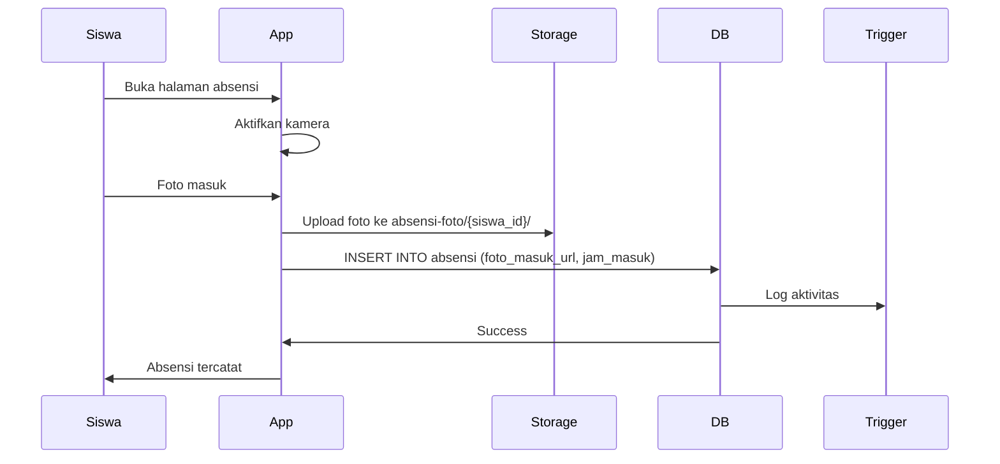
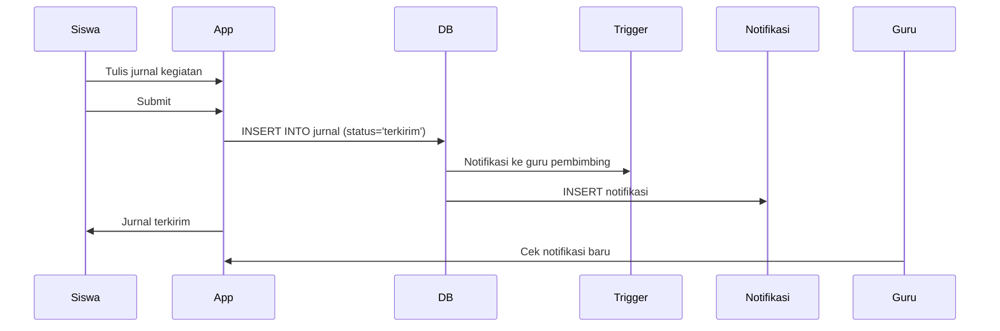
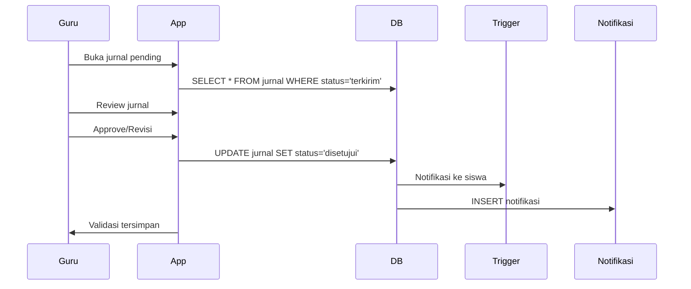
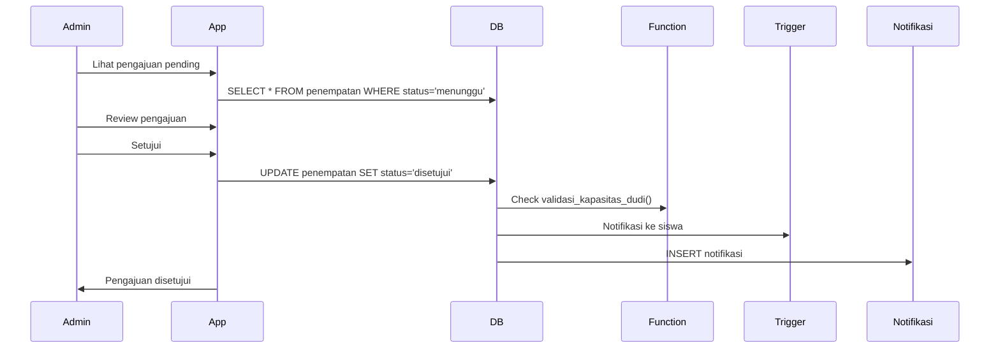

# Entity Relationship Diagram (ERD) - SIMMAS

## 📊 Visual Database Structure

```
┌─────────────────┐
│     USERS       │
│─────────────────│
│ PK: id          │◄─────┐
│ email           │      │
│ password_hash   │      │
│ role            │      │
│ is_active       │      │
└─────────────────┘      │
         │               │
         │               │
    ┌────┴────┐          │
    │         │          │
    ▼         ▼          │
┌────────┐ ┌─────────┐  │
│  GURU  │ │  SISWA  │  │
│────────│ │─────────│  │
│PK: id  │ │PK: id   │  │
│FK:user │ │FK:user  │  │
│nip     │ │nis      │  │
│nama    │ │nama     │  │
│mapel   │◄┤FK:guru  │  │
│kontak  │ │kelas    │  │
│status  │ │jurusan  │  │
└────────┘ │kontak   │  │
    │      │alamat   │  │
    │      │status   │  │
    │      └─────────┘  │
    │           │       │
    │           │       │
    │      ┌────┴───────┴────┐
    │      │                  │
    ▼      ▼                  ▼
┌──────────────────┐  ┌─────────────┐
│   PENEMPATAN     │  │    DUDI     │
│──────────────────│  │─────────────│
│PK: id            │  │PK: id       │
│FK: siswa_id      │──┤kode         │
│FK: dudi_id       │  │nama         │
│FK: guru_id       │  │bidang_usaha │
│posisi            │  │alamat       │
│tgl_pengajuan     │  │kota         │
│tgl_mulai         │  │kontak       │
│tgl_selesai       │  │email        │
│periode           │  │kapasitas    │
│status            │  │status       │
│catatan           │  └─────────────┘
└──────────────────┘         │
         │                   │
    ┌────┴────┐              │
    │         │              │
    ▼         ▼              ▼
┌─────────┐ ┌──────────┐ ┌──────────┐
│ABSENSI  │ │  JURNAL  │ │KUNJUNGAN │
│─────────│ │──────────│ │──────────│
│PK: id   │ │PK: id    │ │PK: id    │
│FK:siswa │ │FK:siswa  │ │FK:guru   │
│FK:penem │ │FK:penem  │ │FK:dudi   │
│tanggal  │ │tanggal   │ │FK:siswa  │
│jam_msk  │ │waktu     │ │tanggal   │
│jam_klr  │ │kegiatan  │ │waktu     │
│foto_msk │ │status    │ │tujuan    │
│foto_klr │ │catatan   │ │hasil     │
│lokasi   │ │FK:valid  │ │catatan   │
│status   │ │tgl_valid │ │foto_url  │
│keterangan│ │         │ │status    │
└─────────┘ └──────────┘ └──────────┘


┌──────────────────┐  ┌──────────────┐  ┌──────────────┐
│  LOG_AKTIVITAS   │  │  PENGATURAN  │  │  NOTIFIKASI  │
│──────────────────│  │──────────────│  │──────────────│
│PK: id            │  │PK: id        │  │PK: id        │
│FK: user_id       │  │key (unique)  │  │FK: user_id   │
│aktivitas         │  │value         │  │judul         │
│modul             │  │tipe          │  │pesan         │
│deskripsi         │  │deskripsi     │  │tipe          │
│ip_address        │  │              │  │link          │
│user_agent        │  │              │  │is_read       │
│created_at        │  │              │  │created_at    │
└──────────────────┘  └──────────────┘  └──────────────┘
```

## 🔗 Relationships

### Primary Relationships

```
users 1───────* guru
users 1───────* siswa

siswa *───────1 guru [guru_pembimbing_id]
siswa 1───────* penempatan
dudi  1───────* penempatan
guru  1───────* penempatan

penempatan 1──* absensi
penempatan 1──* jurnal
siswa      1──* absensi
siswa      1──* jurnal

guru *────────* dudi [through kunjungan]
guru 1────────* kunjungan
dudi 1────────* kunjungan
```

### Supporting Relationships

```
users 1───────* notifikasi
users 1───────* log_aktivitas
guru  1───────* jurnal [validation: divalidasi_oleh]
```

## 📋 Table Details

### Core Tables (11)

| No | Table | Records | Purpose |
|----|-------|---------|---------|
| 1  | users | ~20-100 | Authentication & authorization |
| 2  | guru | ~10-50 | Teacher/supervisor data |
| 3  | siswa | ~50-500 | Student data |
| 4  | dudi | ~10-100 | Company/industry partners |
| 5  | penempatan | ~50-500 | Student placement assignments |
| 6  | absensi | ~10k+ | Daily attendance records |
| 7  | jurnal | ~10k+ | Daily activity journals |
| 8  | kunjungan | ~100-1k | Teacher visits to companies |
| 9  | log_aktivitas | ~1k+ | System activity logs |
| 10 | pengaturan | ~20-50 | System configuration |
| 11 | notifikasi | ~1k+ | User notifications |

## 🔑 Key Fields & Constraints

### Unique Constraints

```sql
users.email         → UNIQUE
guru.nip            → UNIQUE
siswa.nis           → UNIQUE
dudi.kode           → UNIQUE
pengaturan.key      → UNIQUE
absensi(siswa_id, tanggal) → UNIQUE
```

### Check Constraints

```sql
users.role          → IN ('admin', 'guru', 'siswa')
guru.status         → IN ('aktif', 'tidak_aktif')
siswa.status        → IN ('aktif', 'tidak_aktif', 'lulus')
dudi.status         → IN ('terverifikasi', 'menunggu_verifikasi', 'ditolak')
penempatan.status   → IN ('menunggu', 'disetujui', 'ditolak', 'selesai')
absensi.status      → IN ('hadir', 'izin', 'sakit', 'alpha')
jurnal.status       → IN ('draft', 'terkirim', 'direvisi', 'disetujui')
kunjungan.status    → IN ('terjadwal', 'selesai', 'dibatalkan')
notifikasi.tipe     → IN ('info', 'warning', 'error', 'success')
```

### Foreign Key Actions

```sql
-- CASCADE (data child ikut terhapus)
users → guru     ON DELETE CASCADE
users → siswa    ON DELETE CASCADE
siswa → penempatan ON DELETE CASCADE
siswa → absensi   ON DELETE CASCADE
siswa → jurnal    ON DELETE CASCADE

-- SET NULL (reference di-null-kan)
guru → siswa [pembimbing] ON DELETE SET NULL
guru → penempatan         ON DELETE SET NULL
guru → jurnal [validator] ON DELETE SET NULL
```

## 📊 Common Queries

### Dashboard Admin

```sql
-- Statistik dashboard
SELECT * FROM v_statistik_admin;

-- Output: total_siswa, total_guru, total_dudi, siswa_magang_aktif, pengajuan_pending, dll
```

### Monitoring Absensi

```sql
-- Absensi hari ini
SELECT * FROM v_monitoring_absensi 
WHERE tanggal = CURRENT_DATE;

-- Absensi siswa tertentu bulan ini
SELECT * FROM v_monitoring_absensi 
WHERE nis = '202401001' 
  AND EXTRACT(MONTH FROM tanggal) = EXTRACT(MONTH FROM CURRENT_DATE);
```

### Monitoring Jurnal

```sql
-- Jurnal yang perlu validasi
SELECT * FROM v_monitoring_jurnal 
WHERE status = 'terkirim';

-- Jurnal siswa tertentu
SELECT * FROM v_monitoring_jurnal 
WHERE nis = '202401001' 
ORDER BY tanggal DESC;
```

### Dashboard Siswa

```sql
-- Dashboard siswa specific
SELECT * FROM v_dashboard_siswa 
WHERE siswa_id = '{siswa_id}';
```

### Dashboard Guru

```sql
-- Dashboard guru specific
SELECT * FROM v_dashboard_guru 
WHERE guru_id = '{guru_id}';
```

## 🎯 Use Cases

### 1. Siswa Melakukan Absensi



### 2. Siswa Submit Jurnal



### 3. Guru Validasi Jurnal



### 4. Admin Approve Penempatan



## 🔐 Security Model

### Row Level Security

```
┌─────────────────────────────────────┐
│           RLS POLICIES              │
├─────────────────────────────────────┤
│                                     │
│  ADMIN → Full Access                │
│  ├─ All tables                      │
│  ├─ All operations (CRUD)           │
│  └─ No restrictions                 │
│                                     │
│  GURU → Limited Access              │
│  ├─ Own data: Full access           │
│  ├─ Student data: Bimbingan only    │
│  ├─ Jurnal: Validate bimbingan      │
│  └─ Kunjungan: Own records          │
│                                     │
│  SISWA → Restricted Access          │
│  ├─ Own data: Read + Limited update │
│  ├─ Absensi: Own records only       │
│  ├─ Jurnal: Own records only        │
│  └─ Penempatan: Own records only    │
│                                     │
└─────────────────────────────────────┘
```

### Storage Security

```
absensi-foto/
├─ Siswa: Upload own photos
├─ Guru: View bimbingan photos
└─ Admin: All access

dokumen/
├─ User: Own documents
└─ Admin: All documents

kunjungan-foto/
├─ Guru: Upload own photos
├─ Siswa: View related photos
└─ Admin: All photos

profil-foto/
├─ User: Upload own photo
└─ All: View (public bucket)
```

## 📈 Scalability Considerations

### Indexes Strategy

- ✅ Foreign keys → B-tree index
- ✅ Date columns → B-tree index
- ✅ Status columns → B-tree index
- ✅ Text search → GIN index
- ✅ Composite queries → Multi-column index

### Partitioning Strategy (Future)

```sql
-- Partition absensi by year
CREATE TABLE absensi_2024 PARTITION OF absensi
FOR VALUES FROM ('2024-01-01') TO ('2025-01-01');

-- Partition jurnal by year
CREATE TABLE jurnal_2024 PARTITION OF jurnal
FOR VALUES FROM ('2024-01-01') TO ('2025-01-01');
```

### Archiving Strategy

```sql
-- Archive old logs (> 1 year)
CREATE TABLE log_aktivitas_archive (LIKE log_aktivitas);

-- Move to archive
INSERT INTO log_aktivitas_archive
SELECT * FROM log_aktivitas
WHERE created_at < NOW() - INTERVAL '1 year';

DELETE FROM log_aktivitas
WHERE created_at < NOW() - INTERVAL '1 year';
```

---

**Generated:** October 4, 2026  
**Version:** 1.0.0  
**Tools:** PostgreSQL 15, Supabase  
